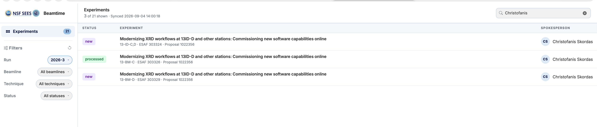
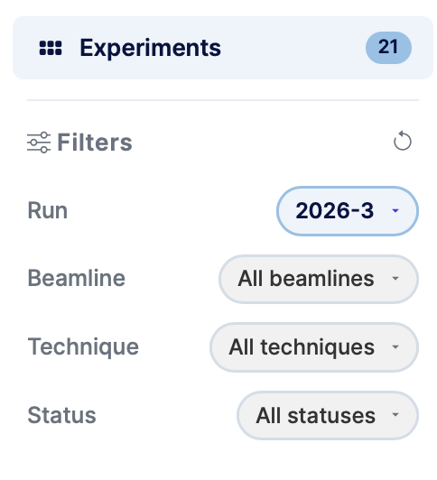
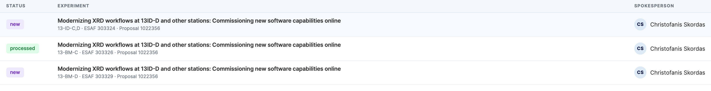

# The Dashboard

The dashboard is the main screen after login. It shows the list of experiments for the current run and lets you filter, search, and open individual experiments.

---

## Layout

The dashboard is split into two areas:

- **Left sidebar** — Filters, navigation, and your user panel.
- **Main content area** — The experiments table with search and status.

---

## Left sidebar

### Filters

Use the dropdowns to narrow down the experiments list:

| Filter | Description |
|---|---|
| **Run** | The beamtime run (e.g. 2026-1). Defaults to the current run. |
| **Beamline** | Filter by a specific APS beamline. |
| **Technique** | Filter by experimental technique within a beamline. |
| **Status** | Filter by processing status (New, Pending, Processed, etc.). |

Click **Reset Filters** to clear all selections and return to the default view.

### User panel

The bottom of the sidebar shows your username and initials avatar. Click **Logout** here to end your session.

---

## Experiments table

Each row in the table represents one experiment and shows:

- **Status** — A colour-coded badge indicating the current processing state (see [statuses](#experiment-statuses) below).
- **Experiment** — The experiment title, ESAF number, proposal number, and assigned beamline.
- **Spokesperson** — The lead researcher for the experiment.

### Search

Type in the search box (top-right of the table) to filter experiments by title, ESAF number, or spokesperson name in real time.

### Opening an experiment

Click any row to open the [experiment detail view](experiments.md).

---

## Experiment statuses

| Status | Meaning |
|---|---|
| **New** | Experiment has been imported but not yet configured. |
| **Pending** | Experiment has been added to the queue and is awaiting processing. |
| **Modified** | Experiment was previously processed but has since been edited. |
| **Processed** | Experiment has been fully processed (folders created, DOI minted). |
| **Locked** | Experiment is locked and cannot be edited. |
| **Error** | An error occurred during processing. |
