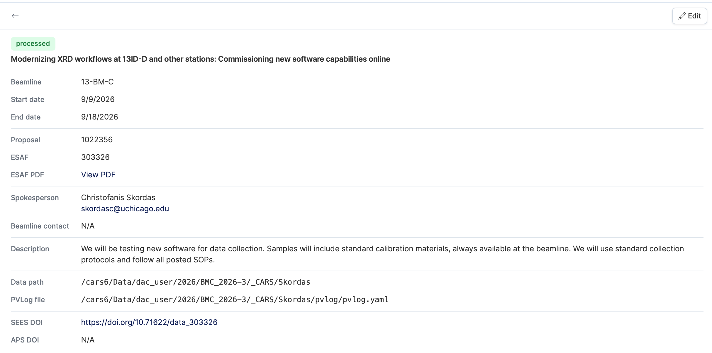
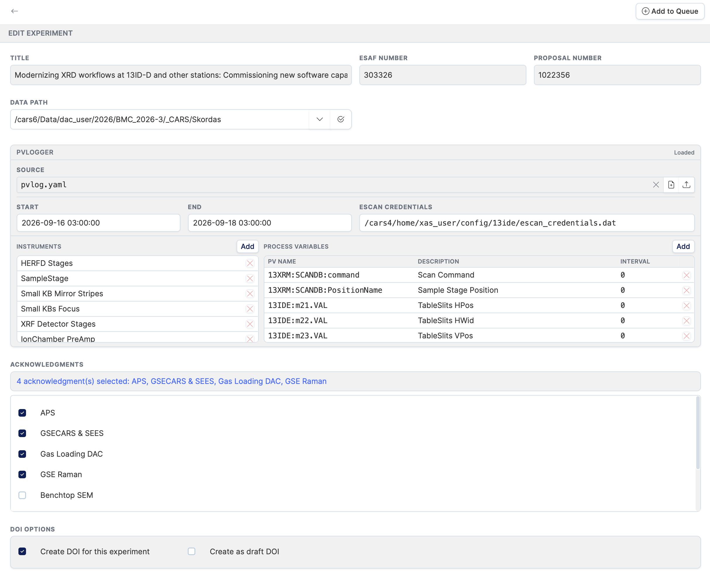
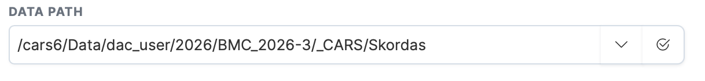
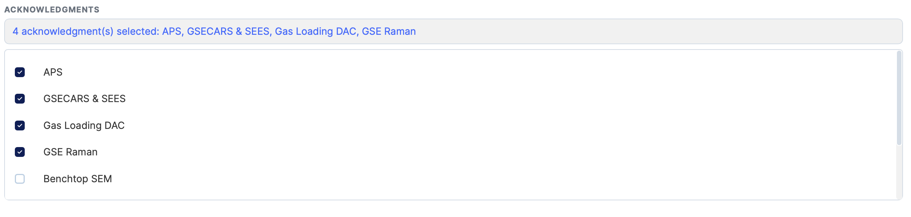
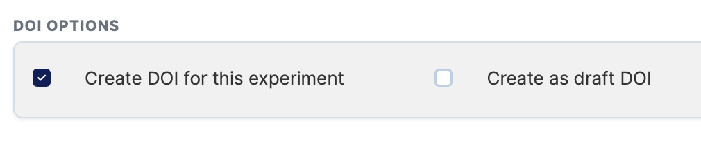

# Viewing and Editing Experiments

Clicking a row in the experiments table opens the **detail view** on the right side of the screen. From here you can review the experiment's metadata and make any necessary edits before [adding it to the queue](queue.md).

---

## Detail view

The detail view shows all read-only properties of the selected experiment.

| Field | Description |
|---|---|
| **Beamline** | The APS beamline assigned to this experiment. |
| **Start / End dates** | Scheduled beamtime window. |
| **Proposal** | Proposal number and link to the proposal PDF. |
| **ESAF** | Experimental Safety Assessment Form number and link to the PDF. |
| **Spokesperson** | Lead researcher responsible for the experiment. |
| **Beamline contact** | Staff contact at the beamline. |
| **Description** | Free-text description of the experiment. |
| **Data path** | Filesystem path where experiment data will be stored. |
| **PVLog file** | Path to the PVLogger YAML configuration file, if set. |
| **SEES DOI** | Assigned SEES DOI, if created. |
| **APS DOI** | Assigned APS DOI, if created. |

---

## Editing an experiment

Click the **Edit** button at the top of the detail view to open the edit form. Changes are not saved until you click **Add to Queue**.

---

### Data path

The data path is the location on the filesystem where the experiment's data will be stored.

- Type the path manually, or click the **path template dropdown** to insert a pre-configured base directory for your technique.
- Click **Validate** to check that the path is correctly formatted and exists on the filesystem. A green message confirms the path is valid; a red message explains what is wrong.

---

### PVLogger configuration

The PVLogger section lets you attach a YAML configuration file that controls what process variables (PVs) are logged during the experiment. See the [PVLogger page](pvlogger.md) for full details.

---

### Acknowledgments

The acknowledgments section lists all available acknowledgment templates from the database.

- Check the box next to each acknowledgment that applies to this experiment.
- The number of selected acknowledgments is shown at the top of the section.
- Selected acknowledgments will be associated with the experiment when it is queued.

---

### DOI options

| Option | Description |
|---|---|
| **Create DOI for this experiment** | When checked, a DOI will be minted for this experiment during processing. Checked by default. |
| **Create as draft DOI** | When checked, the DOI is created as a draft (not publicly registered). Only available when "Create DOI" is checked. |
