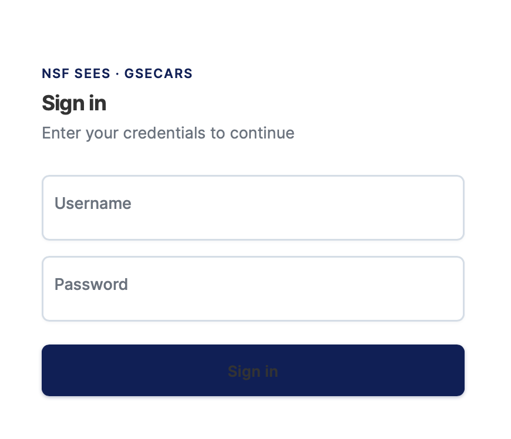

# Logging In

BeamtimeApp uses your CARS credentials to authenticate. No separate account is needed.

---

## Login page

Navigate to the app URL and you will be redirected to the login page automatically if you are not already signed in.

### Fields

| Field | Description |
|---|---|
| **Username** | Your CARS username. |
| **Password** | Your CARS password. |

Click **Login** to authenticate. On success you will be taken to the [dashboard](dashboard.md).

---

## Logging out

Click your username/avatar in the bottom-left corner of the sidebar, then click **Logout**. Your session is cleared immediately.
