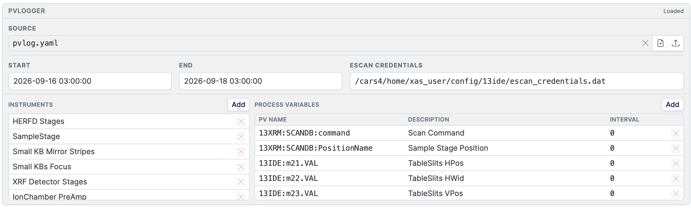

# PVLogger Configuration

The PVLogger section within the experiment edit form lets you create or attach a YAML file that defines which process variables (PVs) are recorded during the experiment, along with the logging time window and instrument definitions.

---

## Loading a file

You have three options for loading a PVLogger configuration:

### 1. Use a template

Click the **Source** dropdown to select a pre-configured template for your beamline/technique. Templates are YAML files maintained by beamline staff and cover common PV sets for each station.

### 2. Upload a file

Click **Upload YAML** to select a `.yaml` or `.yml` file from your computer. The file will be uploaded to the uploads directory and loaded into the editor.

### 3. Create a new file

Click **Create new** to start with a blank YAML file. The file is created in the uploads directory and named after the ESAF number (`pvlog_<esaf>.yaml`).

---

## Editing the configuration

Once a file is loaded, the editor shows three sections.

### Time window

| Field | Format | Description |
|---|---|---|
| **Start datetime** | `YYYY-MM-DD HH:MM:SS` | When to start logging PVs. |
| **End datetime** | `YYYY-MM-DD HH:MM:SS` | When to stop logging PVs. |
| **EScan credentials** | File path | Path to the EScan credentials file on the beamline system. |

### Instruments

The instruments panel lists all instruments defined in the configuration.

- Click **Add instrument** to append a new instrument entry.
- Each instrument can be edited inline.

### Process variables

The PVs panel lists each process variable to be logged.

| Column | Description |
|---|---|
| **PV name** | The EPICS process variable name (e.g. `13IDA:m1.RBV`). |
| **Description** | Human-readable label for this PV. |
| **Interval** | Logging interval in seconds. |

Use the row action buttons to remove individual PVs.

---

## Saving

When you are done editing, you have two save options available via the save button:

| Option | Description |
|---|---|
| **Save as queue copy** | Saves the file to the uploads directory as `pvlog_<esaf>.yaml`. This is the file that will be used during processing. Does not overwrite the source template. |
| **Overwrite source** | Overwrites the original source file (template or uploaded file) in place. Use with caution if the source is a shared template. |

The saved file path is shown next to **PVLog file** in the [detail view](experiments.md).
