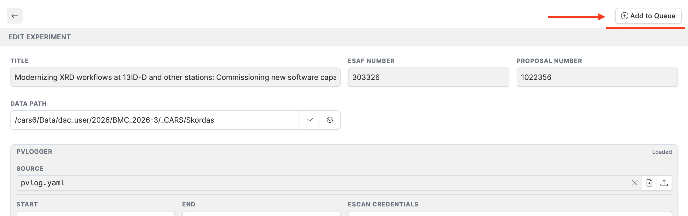

# Adding an Experiment to the Queue

Once you have configured the data path, PVLogger file, acknowledgments, and DOI options for an experiment, click **Add to Queue** to submit it for processing.

---

## What happens

1. The experiment's current status is saved internally.
2. The experiment status is updated to **Pending**.
3. A queue entry is created containing:
   - The ESAF number
   - The configured data path
   - The PVLogger YAML file path (if set)
   - DOI creation flags
   - Selected acknowledgment IDs
4. The dashboard refreshes and the experiment row shows the **Pending** badge.

A confirmation message at the top of the screen tells you whether the experiment was queued successfully or if there were any warnings.

---

## What gets processed

The queue entry is picked up by an external processing job that handles:

- **Folder creation** — Creates the directory structure at the specified data path.
- **DOI minting** — Registers a SEES DOI and/or APS DOI if requested.
- **Globus/Nextcloud links** — Generates collection data links for the experiment.
- **PVLogger deployment** — Places the YAML configuration file in the correct location on the beamline system.

Once processing completes, the experiment status changes to **Processed**.

---

## Checking queue status

The experiment's status badge on the dashboard reflects where it is in the workflow:

| Status | Meaning |
|---|---|
| **New** | Not yet queued. |
| **Pending** | In the queue, awaiting processing. |
| **Processed** | Processing complete. |
| **Error** | Processing failed — contact beamline staff. |

For a full description of all statuses, see the [Dashboard](dashboard.md#experiment-statuses) page.
